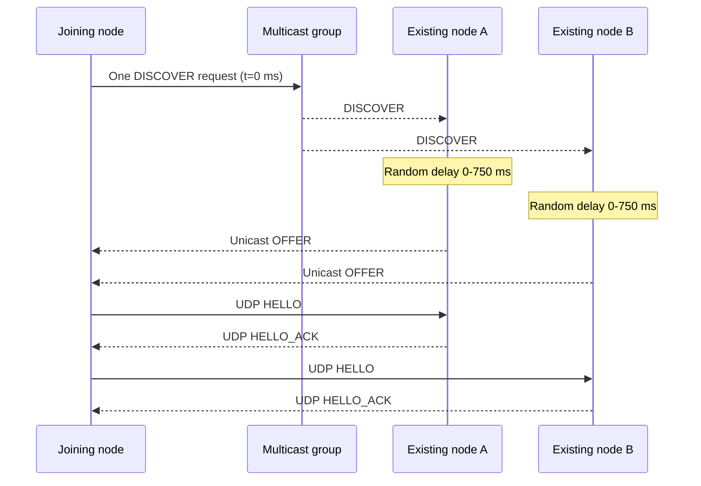
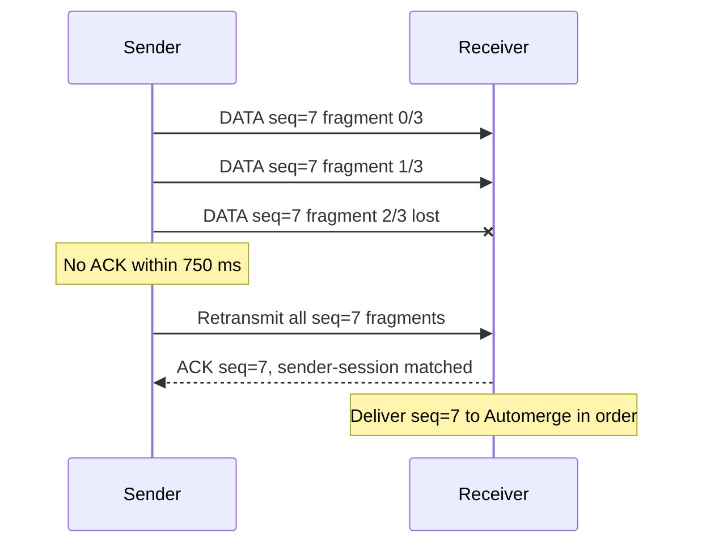

# FieldMesh UDP Protocol Reference

Status: experimental proof-of-concept protocol. This document describes the implementation in this repository; it is not yet a stable interoperability specification.

## Goals

- Operate on an isolated IPv4 LAN without internet or a central server.
- Discover peers without continuous high-frequency announcements.
- Carry Automerge sync messages over UDP while preserving their required reliable, in-order semantics.
- Recover after packet loss, duplicate delivery, reordering, process restart, or temporary network partition.
- Keep the design observable through structured wire logs.

Non-goals for this version include routing across subnets or radios, congestion control, cryptographic identity, encryption, authorization, and high-rate telemetry.

## Ports and traffic classes

| Default port | Transport | Purpose |
|---|---|---|
| `4310/TCP` | HTTP and WebSocket | Local browser UI only |
| `4310/UDP` | Unicast | Peer handshake, reliable Automerge synchronization, ACKs |
| `4311/UDP` | Multicast, broadcast fallback, unicast | Peer discovery |

The browser WebSocket never carries node-to-node traffic.

## Discovery protocol

Discovery messages are UTF-8 JSON using protocol identifier `fieldmesh-discovery-v2`.

### Join and repair sequence



Each response delay is chosen independently and uniformly from 0 through 750 ms. This jitter spreads replies from multiple nodes instead of creating a synchronized response burst. A recipient deduplicates repeated request IDs defensively, even though this implementation sends only one multicast request per discovery transaction.

If the joining node has received no offer 1,750 ms after sending multicast, it sends one limited-broadcast request with a fresh request ID. Broadcast is therefore a fallback, not routine duplicate traffic.

There is no discovery timer after this startup transaction and no idle peer heartbeat. If reliable data exhausts its retransmission limit, the peer is removed and discovery is triggered again. A configured manual endpoint is retried every five seconds only while it remains disconnected.

This event-driven choice minimizes idle traffic, but it has a deliberate tradeoff: two already-running partitions that come into range will not notice one another until an application send fails and triggers discovery, a new node issues discovery, or an operator restarts/triggers discovery. A production radio integration should invoke discovery from link-up and interface-change events.

### Discovery request

```json
{
  "protocol": "fieldmesh-discovery-v2",
  "type": "discover",
  "requestId": "8-byte-random-hex",
  "peerId": "stable-device-id",
  "name": "ALPHA",
  "room": "demo",
  "port": 4310
}
```

### Discovery offer

```json
{
  "protocol": "fieldmesh-discovery-v2",
  "type": "offer",
  "requestId": "new-8-byte-random-hex",
  "replyTo": "discover-request-id",
  "peerId": "stable-existing-device-id",
  "name": "BRAVO",
  "room": "demo",
  "port": 4310
}
```

Offers are sent by unicast to the source address and source port of the request. Offers with the wrong room, self peer ID, malformed fields, or an unknown/expired `replyTo` are ignored.

Each node uses two discovery sockets. A shared listener binds `4311/UDP`, joins the multicast group on every active non-loopback IPv4 interface, and receives discovery requests. A second socket binds a unique ephemeral UDP port, sends discovery requests, and receives unicast offers. The unique reply port prevents an offer from being misdelivered to another process sharing port 4311. Messages carrying the local peer ID are discarded before logging or processing.

For same-computer simulation, there is one additional bootstrap mechanism. Windows does not reliably deliver one multicast datagram to every Node process sharing the discovery port. Each process therefore writes `{ pid, peerId, room, queryPort }` to `fieldmesh-discovery-v2` under the operating-system temporary directory. A joining process reads live records for its room and sends one UDP `DISCOVER` to each loopback query port. Responses, handshakes, ACKs, and sync data remain real UDP traffic. Records are removed on graceful shutdown and stale process records are ignored and removed. This registry is local-only, carries no replicated application data, is not shared between devices, and is not part of the field protocol.

### Discovery acknowledgement semantics

`DISCOVER` has no conventional ACK because an unknown number of peers may exist. Each `OFFER` is evidence that one peer received the request. An offer is not explicitly ACKed; the joining node's subsequent peer `HELLO`, followed by `HELLO_ACK`, confirms the discovery result and establishes both return reachability and the peer session.

## Reliable UDP peer protocol

Automerge's sync protocol assumes reliable, in-order delivery between each pair of peers. FieldMesh supplies those properties above UDP.

### Datagram header

Every peer datagram begins with this 28-byte, network-byte-order header:

| Offset | Size | Field | Description |
|---:|---:|---|---|
| 0 | 4 | magic | ASCII `FMU1` |
| 4 | 1 | version | `1` |
| 5 | 1 | packet type | `1=HELLO`, `2=HELLO_ACK`, `3=DATA`, `4=ACK` |
| 6 | 2 | fragment index | Zero-based fragment position |
| 8 | 4 | sender session | Random process/peer session identifier |
| 12 | 4 | sequence | Reliable logical-message sequence |
| 16 | 4 | ACK session | Session being acknowledged |
| 20 | 4 | ACK sequence | Logical message being acknowledged |
| 24 | 2 | fragment count | Total fragments in logical message |
| 26 | 2 | payload length | Bytes following the header |

Malformed magic, version, type, lengths, or fragment metadata are discarded.

### Handshake

`HELLO` and `HELLO_ACK` carry JSON containing the protocol (`fieldmesh-udp-v1`), peer ID, display name, room, and UDP port. A room mismatch is ignored. The handshake establishes an endpoint-to-peer mapping and detects a process session change.

`HELLO` is explicitly answered by `HELLO_ACK`. Manual peers refresh the handshake when no peer traffic has been received for three seconds. Discovery beacons provide liveness for automatically discovered peers.

### Data fragmentation

One Automerge sync message is one reliable logical message. Its encoded bytes are split into payloads of at most 1,000 bytes. Including the FieldMesh header, a full fragment is 1,028 bytes before UDP/IP/link headers. The limit is 8,192 fragments, approximately 8 MiB per logical message.

Fragments may arrive in any order. The receiver stores them by peer session, message sequence, and fragment index. It reconstructs a logical message only after every fragment is present.

### Ordering

Each sender assigns increasing sequences starting at one. Completed messages that arrive ahead of a missing sequence remain buffered. Only the next expected sequence is delivered to `Automerge.receiveSyncMessage()`. After that message is processed, consecutive buffered messages are drained in order.

### ACK and retry behavior



- Every complete logical Automerge sync message receives one ACK.
- Individual fragments are not ACKed in this POC.
- If an ACK is absent for 750 ms, all fragments of that logical message are retransmitted.
- A message is attempted at most ten times.
- After retry exhaustion, the peer is removed and discovery/manual connection can establish a fresh session.
- Duplicate fragments are ignored.
- Duplicate messages below the expected sequence cause the ACK to be sent again. This recovers when the original ACK was lost.
- ACK packets are not themselves ACKed; acknowledging acknowledgements would never terminate.

An ACK means the remote process reassembled and accepted the complete logical message into its ordered receive buffer. It does not mean the data was displayed or read by a human. The separate Automerge `hasOurChanges` state drives the UI's `SYNCED` indicator and confirms that the peer's Automerge state has acknowledged the local history.

### Restart and session recovery

Each process generates a random session identifier. When a known peer presents a different session, sequence counters, pending transmissions, reassembly buffers, and Automerge sync state are reset for that peer. Both peers then compare their persisted Automerge histories and exchange whatever is missing. This prevents a rapidly restarted peer from waiting for sequence numbers that existed only in its lost memory.

## Automerge synchronization

The reliable UDP payload is the unmodified binary result of `Automerge.generateSyncMessage()`. FieldMesh does not transmit the data directory or identity file. Automerge exchanges heads, Bloom-filter summaries, requests, and missing changes. A new or far-behind replica may receive a compressed representation approaching the full document size; routine updates are incremental.

The current room is one Automerge document containing chat, tracks, and drawings. Production work should split these into independent documents to enable prioritization, selective subscriptions, retention, and bounded synchronization.

## Wire-log interpretation

| Event | Actual transmission? | Meaning |
|---|---:|---|
| `udp.multicast-discover` | Yes | Discovery request to multicast group |
| `udp.broadcast-discover` | Yes | Fallback discovery request |
| `udp.loopback-discover` | Yes | One local UDP request per already-running same-host simulator node |
| `udp.unicast-offer` | Yes | Jittered response to joining node |
| `offer.scheduled` | No | Local timer decision |
| `offer.accepted` | No | Local validation of an offer |
| `udp.hello`, `udp.hello-ack` | Yes | Peer handshake |
| `udp.data` | Yes | One reliable-message fragment |
| `udp.ack` | Yes | Complete logical-message acknowledgement |
| `udp.retransmit` | No by itself | Retry decision; following `udp.data` records are transmissions |
| `socket.send` / `udp.socket-send` | No additional packet | OS completion callback for a preceding send |
| `automerge.sync` | No additional packet | Decoded interpretation of data carried by `udp.data` |

Actual UDP sends and receives use the `[comms]` prefix and `recordKind: "udp-datagram"`. The `direction` field distinguishes transmission (`tx`) from reception (`rx`). Decoded payloads, socket callbacks, browser messages, and local decisions use `[trace]`; these are not additional mesh packets. `networkScope` is `lan`, `loopback`, `local-client`, or `process`. In full mode, `payload` and `rawBase64` are two log representations of the same bytes, not two transmitted copies.

## Known production gaps

Before interoperable or operational deployment, define test vectors and add:

- token-bucket pacing and a shared 1 Mbps budget;
- priority queues so chat/orders can preempt drawings and bulk catch-up;
- selective fragment retransmission with ACK bitmaps;
- bounded reassembly memory and per-peer rate limits;
- authenticated peer identity, message integrity, encryption, replay protection, and key rotation;
- membership and revocation rules;
- protocol negotiation and schema migration;
- persistent per-peer Automerge sync state;
- metrics for useful payload, protocol overhead, retries, loss, and convergence latency;
- fuzz tests and tests over representative radios, latency, loss, duplication, and reordering.
